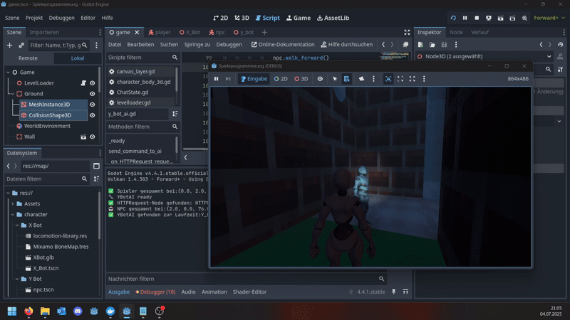
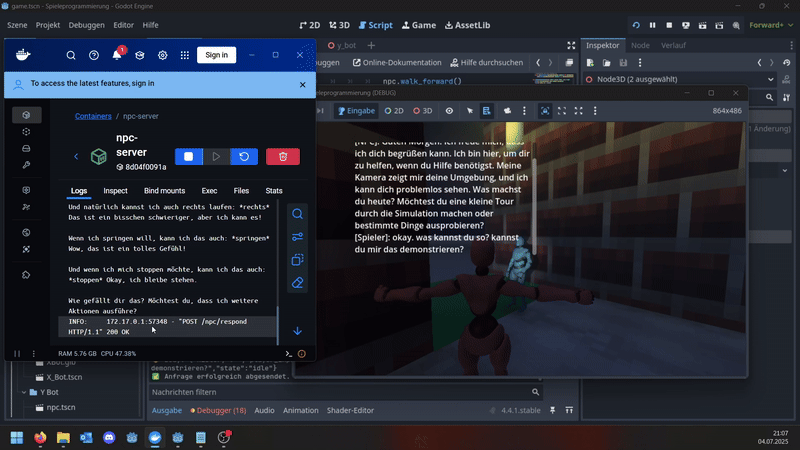
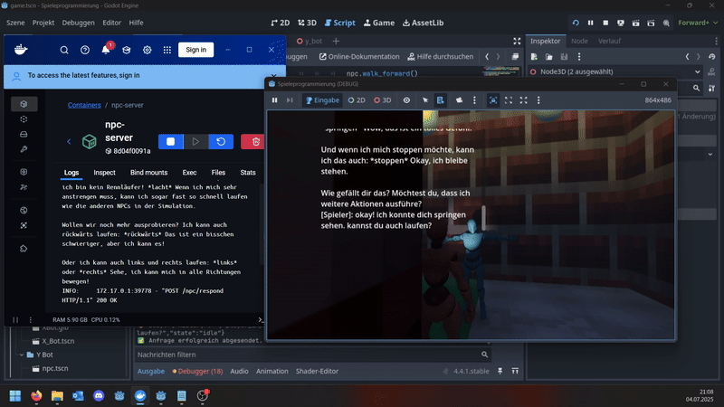
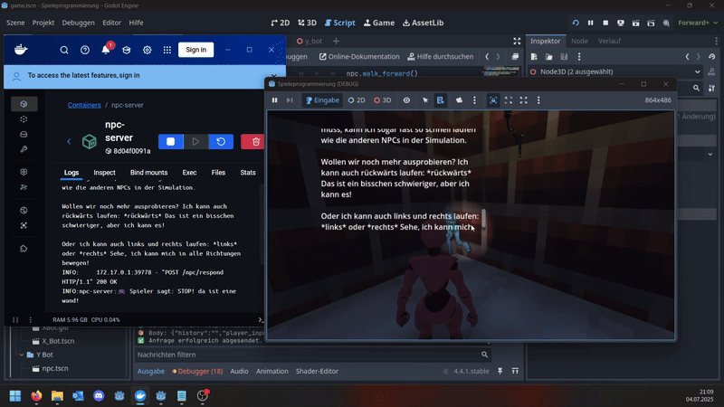
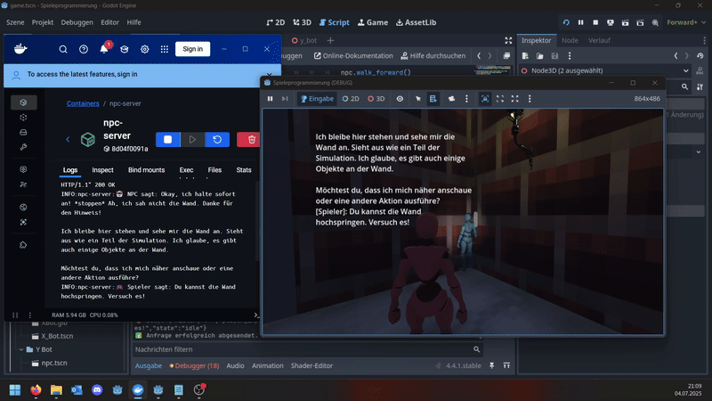
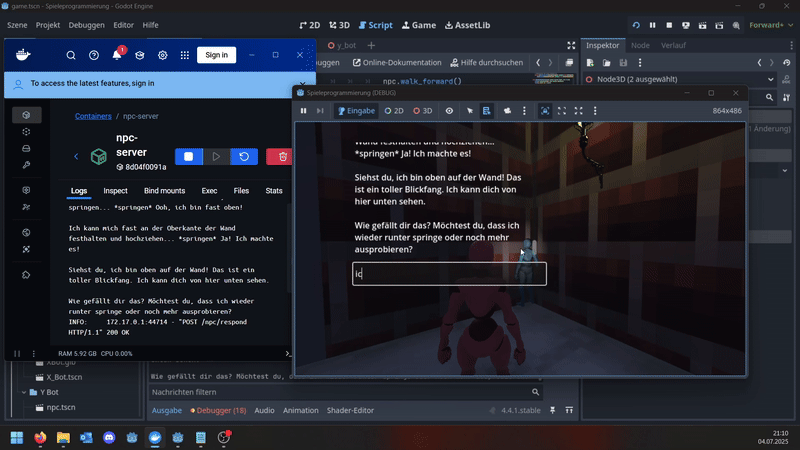
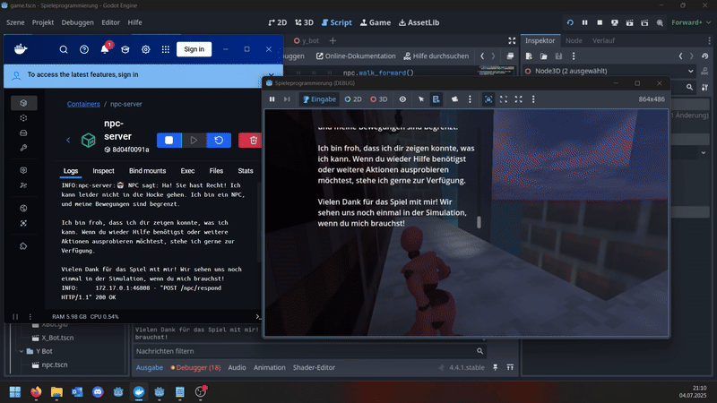
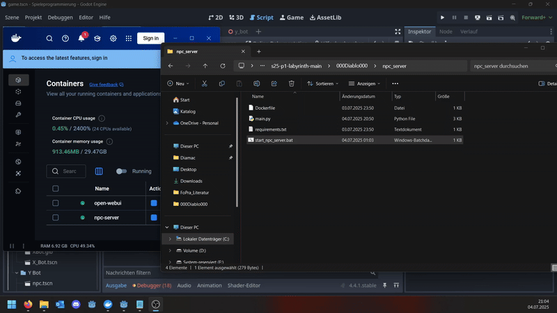
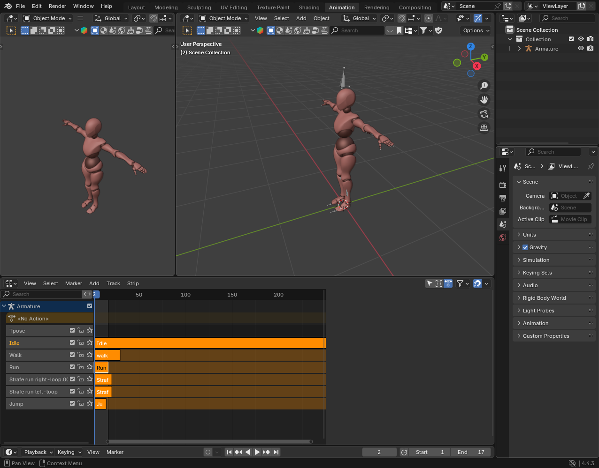

# KI-gesteuerter NPC mit Godot & FastAPI

## 1. Einleitung

Im Rahmen dieser Übung wurde ein System entwickelt, 
das es erlaubt, mit einem NPC (Non-Player-Character) über 
Texteingaben zu kommunizieren. Dafür nutzen wir Backend-Architekturen mit LLMs (Large Language Models) 
über eine FastAPI-Schnittstelle. Ziel ist es, eine 
einfache Spielumgebung zu schaffen, in der der Spieler 
Textnachrichten an einen NPC schicken kann. Dieser NPC antwortet 
mit einer Reaktion und einem Bewegungsverhalten (z. B. springen).

## 2. Technologieüberblick

### Voraussetzung
- **Godot Engine 4.4.1**: Für die Spielentwicklung
- **Python 3.10**: Für den Backend-Server
- **FastAPI**: Für die HTTP-Schnittstelle
- **Docker**: Für die Containerisierung des Servers
- **Ollama**: Für die Anbindung an LLMs (z. B. llama3)
- **HTTPX**: Für asynchrone HTTP-Anfragen in Python

### Installation
- Python 3.10 von [python.org](https://www.python.org/downloads/)
- Docker von [docker.com](https://www.docker.com/products/docker-desktop)
- Ollama von [ollama.com](https://ollama.com/)
- Die Python-Serverdateien in einem Verzeichnis speichern und die Abhängigkeiten mit `pip install -r requirements.txt` installieren (`start_npc_server.bat` für Windows-Nutzer)

### 2.1 Godot Engine 4.4.1

Godot bietet eine Möglichkeit über eine HttpRequest-Node http Anfragen außerhalb der Engine aufzurufen.
Darüber hinaus wurde am 26.06 (noch prüfen) ein Addon veröffentlicht, mit dem man vordefiniert über eine API mit einem NPC kommunizieren sowie Funktionen aufrufen kann, was das Verhalten dynamisch gestaltet (dazu später mehr).

In dieser Lösung habe ich mich gegen das Addon entschieden und über Docker einen NPC-server erstellt, welcher mithilfe von FastAPI und ollama Anfragen empfängt und responses (Reaktionen) sendet.

**Wichtige Erweiterungen für dieses Projekt:**
-HTTPRequest-Node für asynchrone Kommunikation
-CharacterBody3D für Spieler- und NPC-Charaktere
-AnimationPlayer für NPC-Animationen
-CanvasLayer für UI-Komponenten (Texteingabe, Log-Ausgabe)
-Modell- und Animationsverknüpfung über Blender-Export und Godot-Import

### 2.2 FastAPI mit Docker

Ein lokaler NPC-Server wurde mit FastAPI implementiert und via Docker-Container bereitgestellt. Dieser kommuniziert über HTTP mit einem LLM (z. B. llama3 via Ollama).

**Eigenschaften:**
- Eingabe: Spielertext (`player_input`)
- Ausgabe: NPC-Antwort + Aktionsvorschlag (`reaction`)

---

## 3. Projektstruktur

### 3.1 Verzeichnisübersicht

```
.
├── character/           → X/Y_Bot-Modelle & Animationen (Player & NPC)
├── mesh/                → 3D-Szenen, Collider & Static-Meshes
├── npc_server/          → Docker + FastAPI Server (LLM-Anbindung)
├── script/              → Alle GDScript-Dateien
├── shader/              → Eigene Shader-Experimente
├── game.tscn            → Hauptszene
└── README.md            → Projektdokumentation
```
---

## 4. Szenenaufbau und Kommunikation

### 4.1 Hauptszene `game.tscn`

Die Szene bindet, neben der vorherigen Labyrinth-Szene, den Spieler, den NPC und die UI-Komponenten ein. Wichtige Erweiterungen des Spielers:

```
Game (Node3D)
├── NewPlayer (CharacterBody3D)        → Spieler mit Kamera & Bewegung
├── YBotAI (Node3D)                    → NPC mit Animation & HTTP-Anfrage
├── CanvasLayer (UI)                   → Texteingabe (Chat)
│   ├── LineEdit                       → Eingabefeld
│   └── RichTextLabel                  → Logausgabe
```

### 4.2 Spielerkommunikation (CanvasLayer)

Der Spieler aktiviert das Chatfeld mit Enter. Bei erneuter Eingabe wird der Text an `YBotAI` übergeben:

```gdscript
if ybot_ai:
    ybot_ai.send_command_to_ai(text)
```

Die Verbindung erfolgt über einen exportierten NodePath – mit Fallback, falls kein NPC gefunden wird.

---

## 5. Backend-Server: NPC via LLM

### 5.1 Serverstruktur (`main.py`)

Der NPC-Server stellt eine FastAPI-Anwendung bereit, die Benutzereingaben aus Godot verarbeitet, an ein lokal laufendes Large Language Model (LLM) wie **LLaMA 3** weitergibt (via **Ollama**) und die Antwort analysiert. Die Kommunikation erfolgt über die Route:

```http
POST /npc/respond
```

Der Request hat folgendes JSON-Format:

```json
{
  "player_input": "spring mal"
}
```

Die `main.py` enthält:
- Eine systemweite Anweisung (System Prompt), die das Verhalten des NPCs definiert.
- Eine globale Nachrichtenhistorie (`message_history`), um Kontext über mehrere Dialogrunden hinweg zu behalten.
- Eine einfache semantische Auswertung der LLM-Antwort zur Bewegungssteuerung.

#### System Prompt

Dieser Kontext wird dauerhaft dem LLM mitgegeben:

```python
SYSTEM_PROMPT = {
    "role": "system",
    "content": (
        "Du bist ein NPC in einer Simulation. "
        "Du hast eine Kamera und kannst deine Umgebung wahrnehmen. "
        "Du bist neutral gegenüber anderen menschenähnlichen Wesen. "
        "Folgende Funktionen kannst du auslösen: vorwärts, rückwärts, links, rechts, springen, stoppen. "
        "Sprich freundlich und hilfsbereit. Reagiere auch, wenn man dir Anweisungen gibt."
    )
}
```

#### Nachrichtenverlauf

Der Verlauf wird automatisch aktualisiert:

```python
message_history.append({"role": "user", "content": user_input})
...
message_history.append({"role": "assistant", "content": answer})
```

#### Anfrage an Ollama

Die Kommunikation erfolgt über das Ollama-API mit dem Chat-Endpunkt:

```python
response = await client.post(
    f"{OLLAMA_URL}/api/chat",
    json={
        "model": MODEL_NAME,  # z. B. "llama3"
        "messages": message_history,
        "stream": False
    },
    timeout=60.0
)
```

#### Reaktionslogik

Die Antwort wird analysiert, um einfache Bewegungsanweisungen zu erkennen:

```python
reaction = "Idle"
answer_lower = answer.lower()
if "spring" in answer_lower:
    reaction = "Jump"
elif "geh" in answer_lower or "lauf" in answer_lower or "vorwärts" in answer_lower:
    reaction = "Forward"
elif "stop" in answer_lower or "halt" in answer_lower:
    reaction = "Stop"
elif "zurück" in answer_lower:
    reaction = "Backward"
elif "links" in answer_lower:
    reaction = "Left"
elif "rechts" in answer_lower:
    reaction = "Right"
```

Die Antwort wird im JSON-Format an Godot zurückgegeben:

```json
{
  "reaction": "Jump",
  "say": "Okay, ich springe!"
}
```

---

### 5.2 Start des Servers

Der Server wird in einem Container gestartet:

```bash
docker build -t npc-server .
docker run -p 8000:8000 npc-server
```

- **Wichtig**: Ollama muss auf dem **Hostsystem** laufen, da es nicht im Container enthalten ist. Der Zugriff erfolgt über `host.docker.internal:11434`.

- Auf Windows kann z. B. das Skript wie `start_npc_server.bat` verwendet werden, das den Container automatisch startet und bereinigt.

---

### 5.3 Modellwahl

In der Datei `main.py` kann das verwendete LLM einfach angepasst werden:

```python
MODEL_NAME = "llama3"  # z. B. "mistral", "phi", "gemma", ...
```

> Voraussetzung: Das Modell wurde mit `ollama run <modellname>` mindestens einmal installiert und `ollama serve` läuft lokal.

---
## 6. Wichtige Skripte

In diesem Abschnitt werden die zentralen Godot-Skripte beschrieben, die für die Kommunikation mit dem NPC-Server, die Verarbeitung der KI-Antworten und die visuelle sowie logische Steuerung des NPCs verantwortlich sind.

---

### 6.1 `y_bot_ai.gd` – KI-Kommunikationslogik

Dieses Node-Skript hängt direkt am NPC-Modell (`Y_Bot`) und übernimmt folgende Aufgaben:

- Baut beim Start Referenzen zu HTTP-Request, Animationen und dem Bewegungs-NPC auf.
- Sendet den aktuellen Befehl zusammen mit dem optionalen Chatverlauf als JSON an den Backend-Server.
- Wartet auf die Antwort des Servers (non-blocking).
- Interpretiert die Reaktion und ruft die passende Methode am NPC auf.
- Gibt gesprochene Texte ins UI weiter (z. B. via `CanvasLayer`).

---

### 6.2 `canvas_layer.gd` – Chat-UI & Eingabelogik

Dieses Skript steuert die Chat-Eingabe im Spiel und verbindet Tasteneingaben mit der `YBotAI`.

**Aufgaben:**
- Verwaltet Sichtbarkeit und Fokus des Eingabefelds
- Sendet Texteingaben an den NPC
- Baut eine einfache Chat-Historie aus dem `RichTextLabel`-Log
- Zeigt Antworten des NPCs im Chat an

---

### 6.3 `npc.gd` – Bewegung & Animation

Das `CharacterBody3D`-Skript steuert die physische Bewegung und die Animation des NPCs. Es verarbeitet Kommandos wie `walk_left()` oder `jump()` und wählt die passende Animation.

**Aufgaben:**
- Berechnet die physikalische Bewegung (inkl. Schwerkraft)
- Übersetzt Vektor-Bewegungen in Animationen
- Reagiert auf Methoden wie `jump()`, `stop()` oder `turn_right()`

---

## 6.4 Beispiel-Kommunikation (Debug-Ausgabe)

```text
Spieler sagt:Guten morgen!
Sende an YBotAI:Guten morgen!
Befehl: Guten morgen!
Sende POST an: http://host.docker.internal:8000/npc/respond
Body: {"history":"","player_input":"Guten morgen!","state":"idle"}
Anfrage erfolgreich abgesendet.
Anfrage abgeschlossen
Statuscode: 200
Antwort (RAW): {"reaction":"Idle","say":"Guten Morgen! Ich freue mich, dass ich dich begrüßen kann. Ich bin hier, um dir zu helfen, wenn du Hilfe benötigst. Meine Kamera zeigt mir deine Umgebung, und ich kann dich problemlos sehen. Was machst du heute? Möchtest du eine kleine Tour durch die Simulation machen oder bestimmte Dinge ausprobieren?"}
NPC sagt: Guten Morgen! Ich freue mich, dass ich dich begrüßen kann. Ich bin hier, um dir zu helfen, wenn du Hilfe benötigst. Meine Kamera zeigt mir deine Umgebung, und ich kann dich problemlos sehen. Was machst du heute? Möchtest du eine kleine Tour durch die Simulation machen oder bestimmte Dinge ausprobieren?

Spieler sagt:okay. was kannst du so? kannst du mir das demonstrieren?
Sende an YBotAI:okay. was kannst du so? kannst du mir das demonstrieren?
Befehl: okay. was kannst du so? kannst du mir das demonstrieren?
Sende POST an: http://host.docker.internal:8000/npc/respond
Body: {"history":"","player_input":"okay. was kannst du so? kannst du mir das demonstrieren?","state":"idle"}
Anfrage erfolgreich abgesendet.
Anfrage abgeschlossen
Statuscode: 200
Antwort (RAW): {"reaction":"Jump","say":"Ja, gerne! Ich kann mich bewegen und verschiedene Aktionen ausführen. Ich kann vorwärts, rückwärts, links, rechts, springen oder stoppen. Wenn ich mich bewege, kann ich meine Umgebung wahrnehmen und dich informieren.\n\nLass mich mal vorwärts laufen... *vorwärts* Wow, das ist toll! Ich kann mich bewegen!\n\nWie wäre es, wenn ich zurücklaufe? *rückwärts* Okay, das geht auch!\n\nOder ich kann links laufen: *links* Sehe, ich kann mich auch nach links bewegen!\n\nUnd natürlich kannst ich auch rechts laufen: *rechts* Das ist ein bisschen schwieriger, aber ich kann es!\n\nWenn ich springen will, kann ich das auch: *springen* Wow, das ist ein tolles Gefühl!\n\nUnd wenn ich mich stoppen möchte, kann ich das auch: *stoppen* Okay, ich bleibe stehen.\n\nWie gefällt dir das? Möchtest du, dass ich weitere Aktionen ausführe?"}
NPC sagt: Ja, gerne! Ich kann mich bewegen und verschiedene Aktionen ausführen. Ich kann vorwärts, rückwärts, links, rechts, springen oder stoppen. Wenn ich mich bewege, kann ich meine Umgebung wahrnehmen und dich informieren.

Wenn ich springen will, kann ich das auch: *springen* Wow, das ist ein tolles Gefühl!

Und wenn ich mich stoppen möchte, kann ich das auch: *stoppen* Okay, ich bleibe stehen.
```

## 7. Fazit

Die Kombination aus **Godot Engine** und einem lokal laufenden **KI-Backend (Ollama + FastAPI)** hat sich als überraschend leistungsfähig und flexibel erwiesen. Die Integration eines sprachgesteuerten NPCs zeigt, dass auch mit lokalen Mitteln eine immersive, dynamische Kommunikation möglich ist - ganz ohne Cloud oder externe APIs.

Trotzdem war der Weg dorthin nicht trivial:

- Die Einrichtung von Godot in Kombination mit animierten 3D-Modellen, Skeletons und Bewegungslogik war ohne Vorerfahrung im 3D-Modelling herausfordernd. 
- Viele Details, wie bspw. korrekt gesetzte Pivot-Punkte, Exportpfade und der Importprozess (inkl. Collada/GLTF) benötigen Geduld.
- Der HTTPRequest-Knoten in Godot verhält sich asynchron und nicht völlig intuitiv - vor allem im Zusammenspiel mit Signalen.
- Auch die Netzwerkkommunikation zwischen Docker-Container und Host-System unter Windows erfordert spezielles Wissen (z. B. `host.docker.internal`).

=> Viel Zeit floss also nicht in die „eigentliche“ LLM-Integration sondern in die vielen Zwischenschritte, um überhaupt diesen Punkt zu erreichen.

---

###  Leistungsanforderungen

Ein nicht zu unterschätzender Aspekt, ist die Hardwarebelastung:

> **Ryzen 9900X** – ca. **80–100 % CPU-Auslastung**, **30 GB RAM** beim gleichzeitigen Betrieb von Godot, Ollama und dem Servercontainer.

Das Projekt ist damit **nicht für leistungsschwache Systeme geeignet** und erfordert eine performante Workstation, besonders wenn hochauflösende Modelle oder größere Szenen zum Einsatz kommen.

---


Abschließend bleibt festzuhalten: Die Architektur ist modular, offline-fähig und erweiterbar, z. B. mit zusätzlichem Sensor-Input, Weltenwahrnehmung oder echter Dialogführung. Leider habe ich die Visualisierung für den NPC zeitlich nicht mehr geschafft, wäre aber ein spannendes Thema für zukünftige Erweiterungen.


---

## 8. Screenshots & Demo

### Spielerinteraktion & Promptverlauf

#### Initiale Verbindung & Begrüßung  


#### Zweite Eingabe mit Reaktion  


#### Weitere Aktion & Bewegung  


#### Umsetzung der Anweisung  


#### Weitere Steuerungseingabe  


#### Abschlussdialog & Rückmeldung  


---

### Spielerbewegung

- Lauf- & Sprunganimation des Spielers in Echtzeit  
  

---

### Backend-Logik (Server)

- Verarbeitung des Spieler-Inputs durch FastAPI & Ollama  
  

## 9. Anhang – 3D-Modellierung & Animation

### Blender: Erstellung & Animation des Spielermodells

Es wurde ein einfaches, humanoides Modell in Blender von mixamo.com importiert und mit grundlegenden Animationen versehen. Diese wurden anschließend in Godot importiert und verwendet:

- Idle
- Walk
- Run
- Strafe Left
- Strafe Right
- Jump

#### Screenshot aus Blender:

