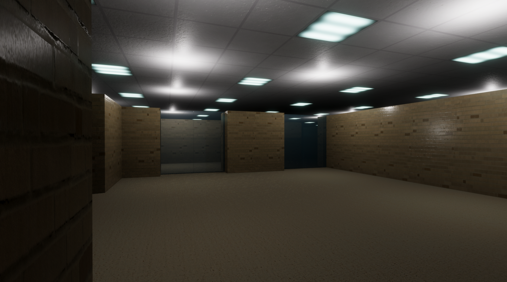
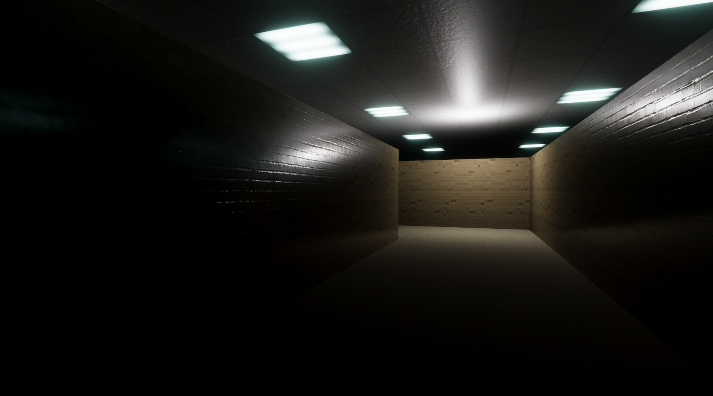
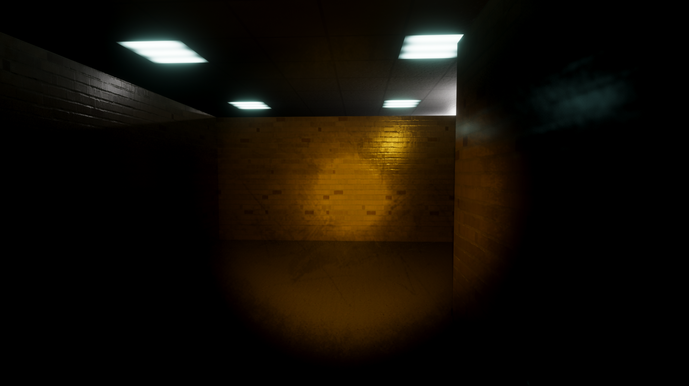

# Begehbares 3D-Labyrinth mit Ray Tracing in Unity

## Projektbeschreibung

Dieses Projekt ist ein interaktives 3D-Labyrinth-Spiel, entwickelt mit Unity und der High Definition Render Pipeline (HDRP). Ziel ist es, in einem realistisch beleuchteten Labyrinth den Ausgang zu finden. Die Spielumgebung nutzt Ray-Tracing-Technologien zur realitätsnahen Darstellung von Licht, Schatten, Spiegelungen und Materialien.

Der Spieler bewegt sich in der Ego-Perspektive durch das Labyrinth, sammelt eine Taschenlampe auf und nutzt diese, um dunkle Bereiche auszuleuchten. Weiter Details sind im beigefügten Bericht "Abgabe_1_Stengl.pdf" zu finden.

Um das Spiel zu starten, wird der gesamte Ordner "Abgabe 1" heruntergeladen. Danach kann "Abgabe 1\Assets\MainScene.unity" mit Unity gestartet werden und los geht's :)

## Features

- 🧭 **Labyrinth-Gameplay**: Spieler startet in der Mitte des Labyrinths und muss den Ausgang suchen.
- 🔦 **Interaktive Taschenlampe**: Muss erst gefunden werden, bevor sie nutzbar ist.
- 🧱 **Realistische Materialien**: Verschiedene Oberflächen mit Absorption, Reflexion und Transparenz.
- 💡 **Dynamische Beleuchtung**: Ray-traced Point Lights, Emission Lights und Shadows.
- 🎮 **Steuerung**: Gehen, Laufen, Springen, Ducken, Lichtsteuerung.

## Steuerung

| Aktion            | Taste                |
|------------------|----------------------|
| Bewegen          | WASD                 |
| Springen         | Leertaste            |
| Ducken           | R                    |
| Laufen           | Umschalttaste (Shift)|
| Kamera drehen    | Mausbewegung         |
| Taschenlampe an/aus | F (nach Einsammeln) |

## Technik & Tools

- **Unity HDRP** – für realistische Grafikeffekte
- **Raytracing Features**:
  - Ambient Occlusion
  - Global Illumination
  - Reflections
  - Shadows
- **Level-Design** mit [Piskel](https://www.piskelapp.com/): Export als C-Array zur Labyrinth-Generierung
- **Materialien von**: [ambientCG](https://ambientcg.com), [3DTextures.me](https://3dtextures.me)

## Quellen

- Unity: https://unity.com/de  
- HDRP & Raytracing-Tutorial: [YouTube](https://www.youtube.com/watch?v=ad9f_nKU0ZA)  
- Texturen: [ambientCG](https://ambientcg.com), [3DTextures.me](https://3dtextures.me)  
- Taschenlampe Asset: [Unity Asset Store](https://assetstore.unity.com/packages/package/18972)  
- Level-Editor: [Piskel](https://www.piskelapp.com)

## Autor

**Jonathan Stengl**  
